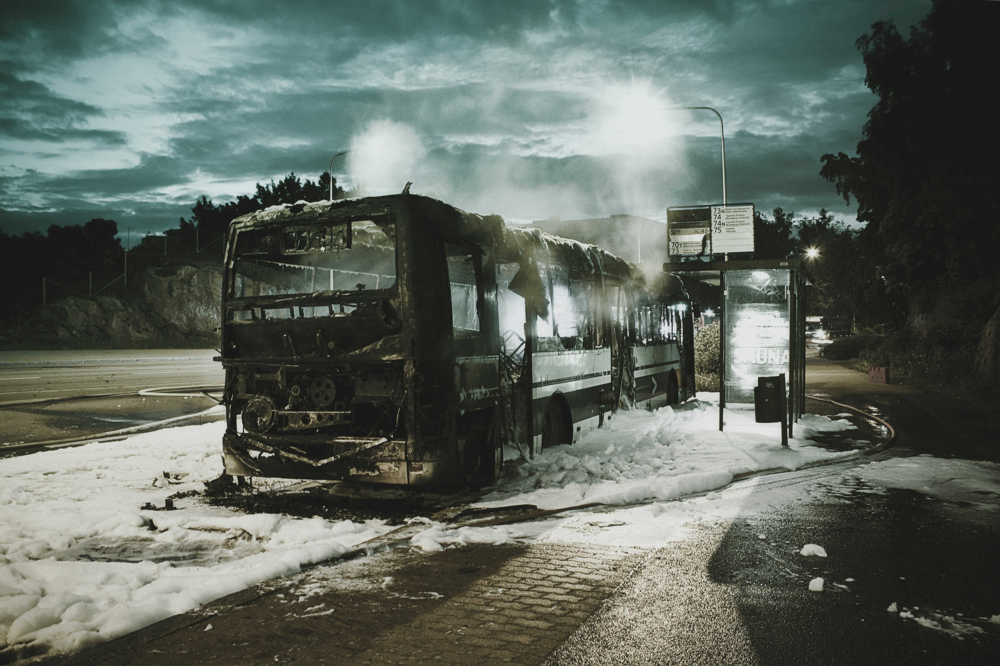

_What if you had a few hundred million dollars in your wallet, but you don't remember where you left it?_

"Wallet" (working title) is a crypto-punk story about a man trying to survive in the post-normal world.

(Photo by [Hans Eiskonen](https://unsplash.com/@eiskonen) on [Unsplash](https://unsplash.com))

Here for the first time? [Start reading here!](chapters/00-preface.md)

## Table of Contents

- [Preface](chapters/00-preface.md) - Start here
- [Chapter 1](chapters/01.md) - Nov 1 - 2906 words (12m read)
- [Chapter 2](chapters/02.md) - Nov 1 - 1629 words (8m read)
- [Chapter 3](chapters/03.md) - Nov 1 - 2850 words (14m read)
- [Chapter 4](chapters/04.md) - Nov 2 - 3595 words (18m read)
- [Chapter 5](chapters/05.md) - Nov 3 - 3135 words (15m read)

_Current total: 14115 words (28.2% of NaNoWriMo goal)._

## Changelog

- [Improved Wint's characterisation in early chapters](https://github.com/jevakallio/NaNoWriMo/pull/6) - Nov 3

- [Make it clearer who Oleg is monitoring](https://github.com/jevakallio/NaNoWriMo/commit/a1e8cc9fcfa8f74f282b2df1cbc4abc1cfc232d5) - Nov 4

  _Read the [detailed changelog here](CHANGELOG.md)._

## FAQ

### When can I read it?

You can read my daily chapters starting November 1st. I'll try to write most days, finishing at over 50,000 words on November 30th as per the rules of [NaNoWriMo](http://nanowrimo.org).

[Follow @wallet_novel on Twitter](https://twitter.com/wallet_novel) for updates throughout the month.

### Where can I read it?

You can read [a pretty-printed distraction free version of this book here](https://jevakallio.github.io/NaNoWriMo), which incidentally looks a lot like my writing environment, so you'll get to enjoy the story in the format it was created in :)

If that's already where you are, alternatively you can read the same [directly on GitHub](https://github.com/jevakallio/NaNoWriMo). Because this novel is a living work in progress, this means I may change things you have already read. I'll try to maintain a changelog of all _big, important_ changes on this page, but if you want to see the complete evolution of the story, you can browse [latest commits](https://github.com/jevakallio/NaNoWriMo/commits/master).

Though beware, I'm sharing my notes and future outlines as well, so skip the commits prefixed with `(spoilers)` if you don't want to know what might happen ahead of time!

### Is it going to be any good?

Probably not. At least not in the traditional sense of "good". Most novels you read in your lifetime have been written by better writers than me, over a much longer period of time, and they have gone through test readings, edits, revisions, etc.

Mine will be a rough first draft written over 30 days. So odds are, it's not going to be _amazing_.

### Why should I read it?

I didn't say that you should.

### Then why are you writing it in the open?

I think it's an interesting experiment, and I want to see what comes out of it. I'm particularly curious how a theoretical audience will affect the quality of my first draft. I have completed NaNoWriMo before, but I never did anything with my manuscripts, because they were so rough they would have required a total rewrite. I'm hoping that, whether or not anyone reads my daily chapters, having to put my work out there will motivate me to plan, outline and refine more as I go.

### Can I give you feedback?

Yes, but be nice! For bigger theme/character/story related feedback, [open a GitHub issue](https://github.com/jevakallio/NaNoWriMo/issue?). For things related to a particular line of text you can [find the corresponding commit where I introduced it](https://github.com/jevakallio/NaNoWriMo/commits/master) and leave a comment right on the line!

Please don't leave comments about typos and such, but if you want to help fix them, [Pull Requests are welcome!](https://github.com/jevakallio/NaNoWriMo/pulls). I'll accept corrections to clear errors, but please don't try to change the writing style or introduce new paragraphs of text. It's my book, not yours!

### Why use GitHub?

Why not!

### About the author

[Jani Eväkallio](https://twitter.com/jevakallio) is a Finnish writer, comedian, improviser and a software programmer living in London. This is his first (self-)published novel.

### LICENSE

Despite being freely available to read on the Internet, the author reserves all intellectual property rights to the book and any other material in the GitHub repository at https://github.com/jevakallio/NaNoWriMo . He is too lazy trying to figure out how to express that in legal language, but basically that means you can not reprint or distribute this book in any form, for free or for profit, other than on [this website](https://jevakallio.github.io/NaNoWriMo).

All contributions to this book, either in form of GitHub issues or pull requests become the author's sole property (this is the point where he's trying to sound fancy and legalese-y, and realised he has no idea what he is doing so he's changing tone for the next sentence) and he gets to do whatever he wants with them, and that's just the way _that_ goes.
